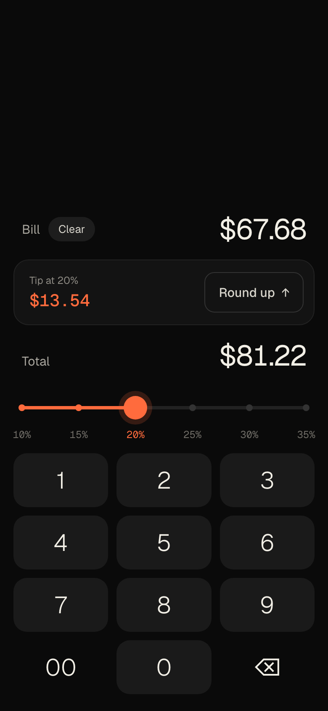

# Tippr

A very simple, useful (to me) tip calculator. It works offline once installed.

All I've wanted from a tip calculator app is the ability to quickly calculate the 3 common tip
amounts, with an optional round up button for when your bill is close to the nearest dollar.

And then it should be dark themed, because how embarrassing is it when you're at a dark bar/restaurant and
your phone becomes a lighthouse beacon to everyone around.

**https://rosshettel.github.io/Tippr/**

## Install on your iPhone

1. Open the link above in **Safari**.
2. Tap the **Share** button. On iOS 26 it's in the **⋯** menu next to the address bar.
3. Tap **Add to Home Screen**. You may need to tap **View More** to find it. Then tap **Add**.

It opens full screen from the home screen icon, like a regular app. On Android, open the link in Chrome and choose **Add to Home screen** from the menu.

## How it works

- **Bill:** type it in cents, like a card terminal: 6, 7, 6, 8 reads $67.68. **00** adds two zeros and **Clear** starts over.
- **Tips:** slide or tap between 10% and 35% in steps of 5. It starts at 20%. The tip rounds up to the cent. **Round up** raises the total to the next whole dollar, makes the tip the difference, and shows the tip percentage that works out to. The math is done in whole cents, so it's exact.
- **Design:** from the "Tip Calculator" design in Claude Design, with Geist and Geist Mono from Google Fonts.
- **Offline:** `web/sw.js` caches the page, icons and fonts, so the app opens with no signal. When you change the list of cached files, bump `CACHE` in `sw.js`. Edits to existing files show up on the second launch after a deploy.
- **Haptics:** Safari has no vibration API, so each key, tip stop label, **Clear** and **Round up** is a `<label>` around a hidden `<input type="checkbox" switch>`. When a finger toggles a switch, iOS 18+ plays its toggle tick. Flipping the switch from code doesn't tick, so the tap has to land on the label. This is unofficial and may stop working in a future iOS. Dragging the slider can't tick on iOS. Android uses `navigator.vibrate`, including as the slider crosses each stop.

## Development

`web/` is plain HTML, CSS and JS with no build step.

- **Run locally:** `python3 -m http.server 8123 -d web`, then open http://localhost:8123.
- **Deploy:** every push to `master` that changes `web/` publishes it to GitHub Pages (`.github/workflows/pages.yml`).
- **Icons:** `scripts/make-icon.swift` renders the icon. Its header comment has the commands for resizing it into `web/icons/`.

## To do

- add a settings page, with options for tip amounts
- perhaps allow tipping calculator for before tax amount?
